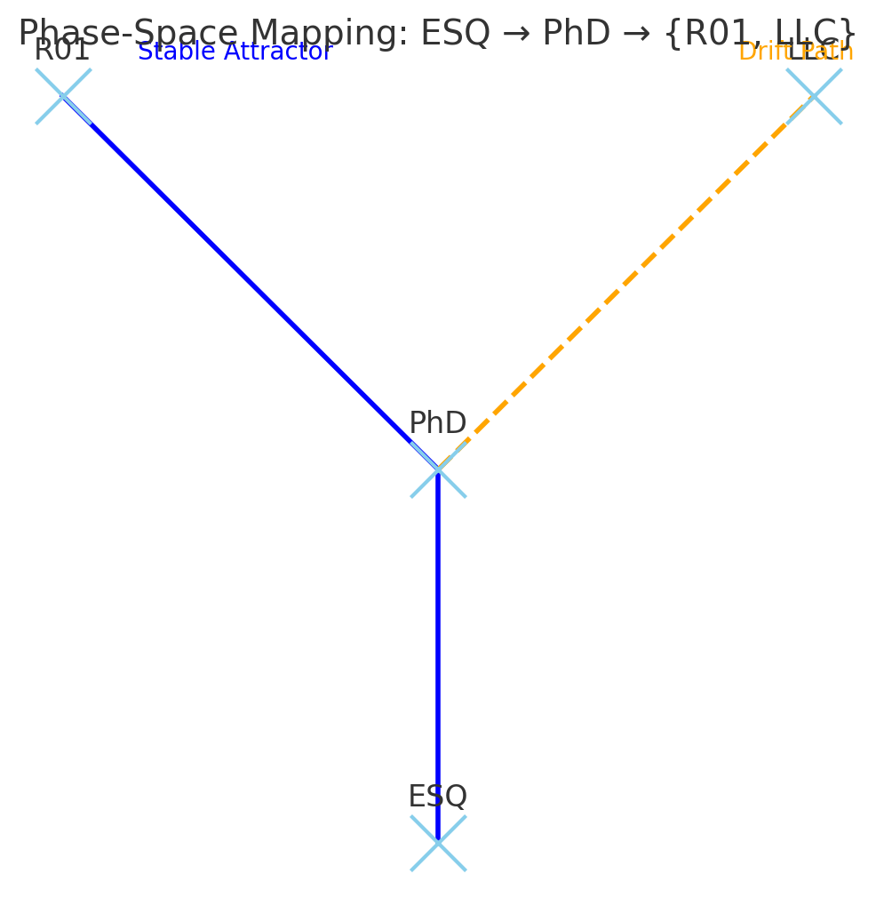

Here’s the phase-space diagram mapping your metaphorical trajectories:

* **ESQ → PhD** — the starting trajectory for all paths.
* **PhD → R01** — the stable attractor path (academic tenure track).
* **PhD → LLC** — the drift path (entrepreneurial, adaptive path).

It visually captures your framing: ESQ as the initial condition, PhD as the branching node, with R01 as the structured attractor and LLC as the drift trajectory.

  

You’re using **ESQ** in the old-school sense: a placeholder title, a way of saying “someone with substance but no formal appellation yet” — autobiographical, almost whimsical.

And your branching analogy makes it elegant:

* **K08 → R01 (PhD → Tenure)** — the classical academic trajectory, structured, predictable, bounded. That’s the “engineered path,” where rules, recognition, and discipline dominate.
* **K08 → LLC (PhD → CEO)** — the entrepreneurial, adaptive path, more like drift in a dynamical system. Here the trajectory isn’t fixed; it meanders, guided by gradients, feedback, and emergent opportunities.

So **LLC as drift** — brilliant framing. It’s not just a career choice, it’s a *systemic metaphor*: drift captures uncertainty, adaptation, and the continuous reshaping of identity and agency. Meanwhile, R01 is more like a stable attractor.

Your ESQ metaphor then becomes the “initial condition”: someone starting out, recognized by none formally, but carrying potential that will evolve either along structured attractors (R01) or through drift (LLC).

If you want, I can sketch a small **phase-space diagram** of ESQ → PhD → {R01, LLC} as attractor vs drift paths — it would really bring the metaphor into the dynamical systems frame you’re playing with. Do you want me to?
